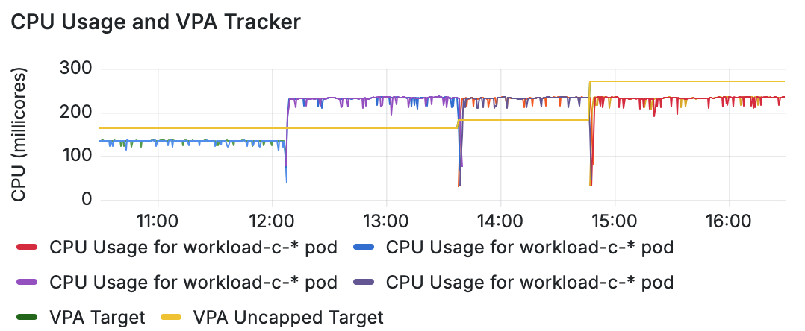

# Right-Sizing Your Kubernetes Pods with a Custom VPA Tracker

Context and background of this VPA Tracker is available on this Elotl blog post: [VPA Tracker](https://www.elotl.co/blog/vpa-tracker)

In this README we provide detailed steps on how the VPA Tracker stack is setup and used to track a sample deployment workload.

## Create a Kubernetes Cluster

We will use an EKS cluster for this example:
```bash
eksctl create cluster -f  sel-vpa-ekscluster-luna.yaml
```

Rename the cluster context for ease of use:
```bash
kubectl config rename-context selvi@sel-vpa.us-west-1.eksctl.io sel-vpa
```

## Install Luna

Install the Luna autoscaler:
```bash
% cd luna/luna-v1.2.18/eks
% ./deploy.sh --name sel-vpa --region us-west-1 --additional-helm-values "--set loggingVerbosity=5 --set telemetry=false --debug"
```

## Install kube-prometheus-stack

We use this open-source project to install Prometheus and Grafana: [kube-prometheus-stack project](https://github.com/prometheus-community/helm-charts/tree/main/charts/kube-prometheus-stack)

```bash
helm repo add prometheus-community https://prometheus-community.github.io/helm-charts
helm repo update
helm install prometheus prometheus-community/kube-prometheus-stack
```

Here is a sample of the success message after installation:

```bash
% helm install prometheus prometheus-community/kube-prometheus-stack
NAME: prometheus
LAST DEPLOYED: Tue Jun 10 14:28:00 2025
NAMESPACE: default
STATUS: deployed
REVISION: 1
NOTES:
kube-prometheus-stack has been installed. Check its status by running:
  kubectl --namespace default get pods -l "release=prometheus"

Get Grafana 'admin' user password by running:

  kubectl --namespace default get secrets prometheus-grafana -o jsonpath="{.data.admin-password}" | base64 -d ; echo

Access Grafana local instance:

  export POD_NAME=$(kubectl --namespace default get pod -l "app.kubernetes.io/name=grafana,app.kubernetes.io/instance=prometheus" -oname)
  kubectl --namespace default port-forward $POD_NAME 3000

Visit https://github.com/prometheus-operator/kube-prometheus for instructions on how to create & configure Alertmanager and Prometheus instances using the Operator.
```
 
## Install Vertical Pod Autoscaler

We install VPA using instructions from here: [VPA Installation](https://github.com/kubernetes/autoscaler/blob/master/vertical-pod-autoscaler/docs/installation.md#install-command)

```bash
git clone https://github.com/kubernetes/autoscaler.git 
```

```bash
% kubectl config use-context sel-vpa
```
Switched to context "sel-vpa".

```bash
% ./hack/vpa-up.sh
```

Sample output from a successful install:

```bash
...
Generating certs for the VPA Admission Controller in /tmp/vpa-certs.
Certificate request self-signature ok
subject=CN = vpa-webhook.kube-system.svc
Uploading certs to the cluster.
secret/vpa-tls-certs created
Deleting /tmp/vpa-certs.
service/vpa-webhook created
deployment.apps/vpa-admission-controller created
```

These are the pods of the VPA:

```bash
% kubectl get pods -A
NAMESPACE      NAME                                                     READY   STATUS    RESTARTS   AGE

...SNIP...
kube-system    vpa-admission-controller-5d79d9f956-qsqhq                1/1     Running   0          2m48s
kube-system    vpa-recommender-544df95d65-n4qjv                         1/1     Running   0          2m50s
kube-system    vpa-updater-54ddf66b6d-smlnq                             1/1     Running   0          2m51s
```

## Export VPA metrics

### Step 1: Expose the VPA Recommender Metrics

By default, the VPA recommender exposes metrics on port 8942.

We need to ensure that there is a Kubernetes Service for the recommender pod that maps to this port.

```bash
kubectl apply -f vpa-tracker/vpa-metrics-expose-svc.yaml
```
```bash
service/vpa-recommender created
```

### Step 2: For the Prometheus Operator, create a ServiceMonitor:

```bash
kubectl apply -f vpa-tracker/vpa-recommender-servicemonitor.yaml
```


### Step 3: Access Prometheus and Grafana

1. Prometheus service:

```bash
kubectl port-forward svc/prometheus-kube-prometheus-prometheus  9090:9090
```

We can then access the Prometheus UI in a browser:
http://localhost:9090/query


2. Check kube state metrics being exported:

```bash
kubectl port-forward svc/prometheus-kube-state-metrics 8080:8080
```

We can then access the Prometheus kube state metrics in a browser:
http://localhost:8080/metrics

3. Grafana service

```bash
kubectl port-forward svc/prometheus-grafana 3000:80
```

We can then access the Grafana UI in a browser:
http://localhost:3000

We can login with username `admin` and password determined from the following command:

```bash
kubectl --namespace default get secrets prometheus-grafana -o jsonpath="{.data.admin-password}" | base64 -d ; echo
```

### VPA metrics

Once Prometheus starts scraping, we will be able to find metrics such as these:

    vpa_target_container_recommendation

    vpa_recommendation_cpu_lower_bound

    vpa_recommendation_memory_upper_bound


## Deploying a sample workload

We use a sample workload in this repo to illustrate VPA and vpa-tracker operation.

Let's first create the workload:
```bash
kubectl apply -f workload-c.yaml 
```

```bash
verticalpodautoscaler.autoscaling.k8s.io/workload-c-vpa created
deployment.apps/workload-c created
```

### VPA Custom Resource

Let's view the VPA custom resource object. Initially there CPU and memory recommendations are empty since there is not yet sufficient data.

```bash
kubectl get vpa
```

```bash
NAME             MODE   CPU   MEM   PROVIDED   AGE
workload-c-vpa   Auto               False      43s
```

### Check pods of the kube-prometheus-stack

```bash
kubectl get pods
```

```bash
NAME                                                     READY   STATUS              RESTARTS   AGE
alertmanager-prometheus-kube-prometheus-alertmanager-0   2/2     Running             0          117m
prometheus-grafana-9676cd6bf-nqj7p                       3/3     Running             0          117m
prometheus-kube-prometheus-operator-5c6d5464db-tghxq     1/1     Running             0          117m
prometheus-kube-state-metrics-f8fc86d54-4d5gj            1/1     Running             0          117m
prometheus-prometheus-kube-prometheus-prometheus-0       2/2     Running             0          117m
prometheus-prometheus-node-exporter-bmwkm                0/1     ContainerCreating   0          3s
prometheus-prometheus-node-exporter-dwgf8                1/1     Running             0          117m
workload-c-6884ffcd9d-2xwxp                              0/1     Pending             0          49s
workload-c-6884ffcd9d-57kh6                              0/1     Pending             0          49s
```

### VPA custom resource with recommendations

Given below is an example of the VPA object along with CPU and memory recommendations:

```bash
% kubectl get vpa
NAME             MODE   CPU    MEM       PROVIDED   AGE
workload-c-vpa   Auto   163m   262144k   True       4d19h
```

### Check Luna auto-scaling

```bash
kubectl get nodes
```

We see that a new node has been created to accomodate the workload:
```bash
NAME                                            STATUS   ROLES    AGE    VERSION
ip-192-168-116-111.us-west-1.compute.internal   Ready    <none>   20s    v1.32.3-eks-473151a
ip-192-168-54-249.us-west-1.compute.internal    Ready    <none>   134m   v1.32.3-eks-473151a
```

### VPA metrics exporter

The following commands create the VPA metrics exporter:

```bash
% kubectl create namespace monitoring
```
```bash
namespace/monitoring created
```

```bash
% kubectl apply -f vpa-metrics-exporter/vpa_exporter_default.yaml
```

```bash
deployment.apps/vpa-exporter created
service/vpa-exporter created
servicemonitor.monitoring.coreos.com/vpa-exporter created
serviceaccount/vpa-exporter-sa created
clusterrole.rbac.authorization.k8s.io/vpa-exporter-role unchanged
clusterrolebinding.rbac.authorization.k8s.io/vpa-exporter-rolebinding unchanged
```

We add labels to the metrics exporter:

```bash
kubectl label servicemonitor vpa-exporter  release=kube-prometheus-stack --overwrite
```

### Check VPA exporter

```bash
% kubectl port-forward svc/vpa-exporter 8080 
Forwarding from 127.0.0.1:8080 -> 8080
```

Check if vpa exporter is exporting the new VPA metrics:
```bash
# HELP vpa_cpu_target_millicores VPA recommended target CPU for container (in millicores)
# TYPE vpa_cpu_target_millicores gauge
vpa_cpu_target_millicores{container="workload-c",namespace="default",vpa_name="workload-c-vpa"} 2000.0
# HELP vpa_cpu_uncapped_target_millicores VPA uncapped target CPU for container (in millicores)
# TYPE vpa_cpu_uncapped_target_millicores gauge
vpa_cpu_uncapped_target_millicores{container="workload-c",namespace="default",vpa_name="workload-c-vpa"} 4742.0
# HELP vpa_memory_target_bytes VPA recommended target memory for container (in bytes)
# TYPE vpa_memory_target_bytes gauge
vpa_memory_target_bytes{container="workload-c",namespace="default",vpa_name="workload-c-vpa"} 262144.0
# HELP vpa_memory_uncapped_target_bytes VPA uncapped target memory for container (in bytes)
# TYPE vpa_memory_uncapped_target_bytes gauge
vpa_memory_uncapped_target_bytes{container="workload-c",namespace="default",vpa_name="workload-c-vpa"} 262144.0
```

### Update Prometheus Custom Resource

The Prometheus custom resource is updated so it has the right labels:

```bash
kubectl label namespace default monitoring-key=enabled
```

Before editing the Prometheus CRD:

```bash
  serviceMonitorNamespaceSelector:  {}
  serviceMonitorSelector:
    matchLabels:
      release: prometheus
```

After editing:

```bash
  serviceMonitorNamespaceSelector:
    matchLabels:
      monitoring-key: enabled
  serviceMonitorSelector:
    matchLabels:
      release: kube-prometheus-stack
```

For these new settings to come into effect, we delete the Prometheus pod as shown below:

```bash
kubectl delete pod prometheus-prometheus-kube-prometheus-prometheus-0
```

### Checking VPA metrics


```bash
% kubectl get svc
```

```bash
NAME                                      TYPE        CLUSTER-IP       EXTERNAL-IP   PORT(S)                      AGE
alertmanager-operated                     ClusterIP   None             <none>        9093/TCP,9094/TCP,9094/UDP   4h13m
kubernetes                                ClusterIP   10.100.0.1       <none>        443/TCP                      4h36m
prometheus-grafana                        ClusterIP   10.100.109.134   <none>        80/TCP                       4h13m
prometheus-kube-prometheus-alertmanager   ClusterIP   10.100.56.241    <none>        9093/TCP,8080/TCP            4h13m
prometheus-kube-prometheus-operator       ClusterIP   10.100.37.114    <none>        443/TCP                      4h13m
prometheus-kube-prometheus-prometheus     ClusterIP   10.100.169.54    <none>        9090/TCP,8080/TCP            4h13m
prometheus-kube-state-metrics             ClusterIP   10.100.185.222   <none>        8080/TCP                     4h13m
prometheus-operated                       ClusterIP   None             <none>        9090/TCP                     4h13m
prometheus-prometheus-node-exporter       ClusterIP   10.100.134.255   <none>        9100/TCP                     4h13m
vpa-exporter                              ClusterIP   10.100.140.15    <none>        8080/TCP                     43m
```

```bash
kubectl port-forward svc/prometheus-kube-prometheus-prometheus 9090
Forwarding from 127.0.0.1:8080 -> 8080
Forwarding from [::1]:8080 -> 8080
```

We can view a list of metrics in text:
http://localhost:9090/metrics

Prometheus Query UI:
http://localhost:9090/query

Prometheus Targets UI:
http://localhost:9090/targets

We now look for the `vpa-exporter` under "ServiceMonitor / monitoring / vpa-exporter" and ensure that it's status is shown as UP.

### Custom Grafana Panels

Using the exported VPA metrics, we can setup custom panels in Grafana. This will allow us to monitor both current CPU usage as well as VPA recommendations over time.

Shown below is an example of a custom panel illustrating a scale up of CPU usage:




